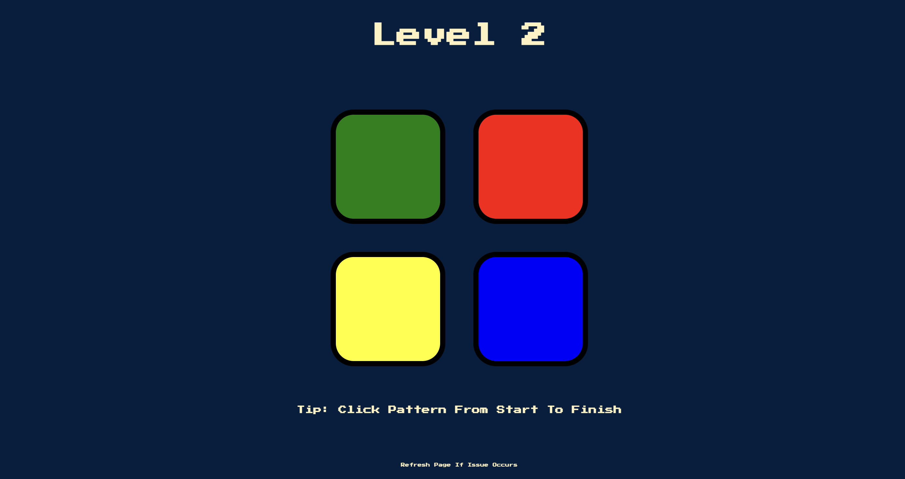

<h1>The Simon Game</h1>

This is created with a primary focus on using jQuery. At the moment this is meant to be played on a computer.

---

<h2>Game Rules</h2>

Click the screen (not a button), then press any key to start. 

A random color will flash and make a sound. Your goal is to click the color that flashed and made the sound. 

If the answer was correct a new random color will flash and make a sound. 

Now you must remember the first random color and click, then click the second random color. 

- You must remember the color pattern from start to finish and click in the same order as the level increases.
The level increases every time you remember the correct order. If you select the wrong color at any time the 
background will flash red playing the game over sound.

You can start a new game when at the game over screen by pressing any key.

